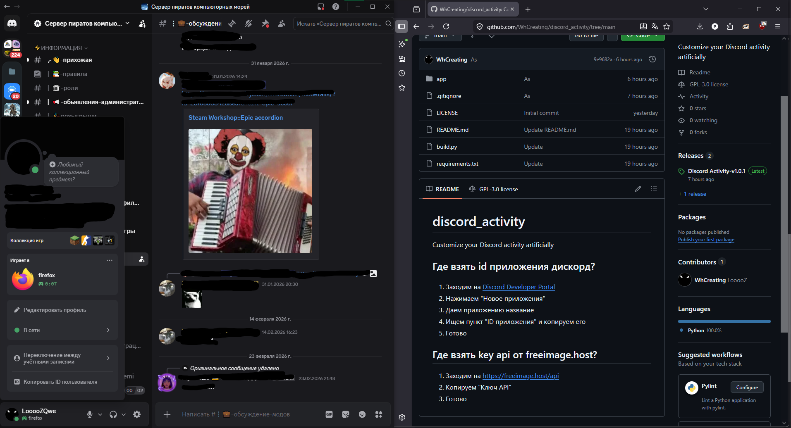

# Discord Activity v1.0.2
В вашей активности дискорда будет отображаться любой открытое вами приложение, кроме самого дискорда и проводника.

## Где взять id приложения дискорд?
1. Заходим на [Discord Developer Portal](https://discord.com/developers/applications)
2. Нажимаем "Новое приложения"
3. Даем приложению название
4. Ищем пункт "ID приложения" и копируем его
5. Готово

## Где взять key api от freeimage.host?
1. Заходим на https://freeimage.host/api
2. Копируем "Ключ API"
3. Готово
